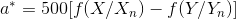
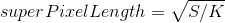
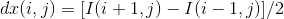

- Attention please: 

- **If you want to reprint my article, please mark the original address and author(刘书裴).**

- **If you are puzzled about a certain part or have some better suggestions, you can contact me: [3017218062@tju.edu.cn]()/[1005968086@qq.com]()**

- **If my blog has mistakes, I'm so sorry!**

- **I think and write everything. Please don't copy.**

- **Thanks for watching!**

| item | tool |
| :---: | :---: |
| image | mspaint |
| formula | Online LaTeX Equation Editor |
| language | python3.7 |
| date | 2020.1.3 |
| author | 刘书裴 |
| members | 刘坤鑫、郭炳成 |

# Directory

1. [SLIC](#1)
    1. [Algorithm](#1.1)
        1. [RGB to LAB](#1.1.1)
        2. [Initialize cluster centers](#1.1.2)
        3. [Iterative clustering](#1.1.3)
    2. [Attention](#1.2)
        1. [Why we change rgb to lab?](#1.2.1)
        2. [Why we choose the 2Sx2S region?](#1.2.2)
    3. [Optimization](#1.3)
        1. [Choose the gradient](#1.3.1)
        2. [Merge all small blocks](#1.3.2)
        3. [Draw the boundary](#1.3.3)
    4. [Result](#1.4)
    
Original image:

# SLIC
<a id="1"/>

## Algorithm
<a id="1.1"/>

### RGB to LAB
<a id="1.1.1"/>

Formula:

However, we can use skimage.color.rgb2lab() to achieve it.

### Initialize cluster centers
<a id="1.1.2"/>

- At first, we set [K](), the number of clusters or super pixels.

- Then divide the image into K super pixel blocks according to equal size.

    

- Initialize the block centers. And use [Cluster]() array to save them.

    

- we need two arrays, [Distance]() and [Label](), to save the distance between current point and the nearest center and the label of the nearest center.

### Iterative clustering
<a id="1.1.3"/>

For each iteration, we choose 2Sx2S region for every point or every center:

- Calculate the Distance array.(the distance between every point and its nearest center)

    

    

    
    
    - m(Nc) is the possible maximum color distance in lab space, and set m=10.
    
    - s(Ns) is the possible maximum spatial distance in lab space, and set s=superPixelLength.

- Choose the Label array.(the label of every point's nearest center)

- Update the Cluster array.(use all point of every cluster to calculate geometric centers)

## Attention
<a id="1.2"/>

### Why we change rgb to lab?
<a id="1.2.1"/>

- It is not only a device independent color model, but also a color model based on physiological characteristics. LAB color model consists of three elements, one is brightness (L), and A and B are two color channels. A includes colors from dark green (low brightness value) to gray (medium brightness value) to bright pink (high brightness value); B is from bright blue (low brightness value) to gray (medium brightness value) to yellow (high brightness value). Therefore, this kind of color will produce bright colors after mixing, and lab mode defines the most colors.

- The segmentation effect of LAB space is much better than that of RGB space.

### Why we choose the 2Sx2S region?
<a id="1.2.2"/>

- Reduce super pixel search area.

- The complexity of SLIC is independent of the number of super pixels.

## Optimization
<a id="1.3"/>

### Choose the gradient
<a id="1.3.1"/>

It can avoid locating the super pixel on the edge and reduce the chance of replacing the super pixel with noise.

In the 3x3 domain of every center:

- Calculate gradient of 8 neighbors.

    
    
    
    
    

- Choose the point with the smallest gradient as the center node of the new center.

### Merge all small blocks
<a id="1.3.2"/>

Because of the characteristics of clustering process, it is not guaranteed that every class can be continuous in XY space.

Thus 

- Count the Label array.

- Initialize the threshold.

- Merge small block into right block.

### Draw the boundary
<a id="1.3.3"/>

Obviously, 

## Result
<a id="1.4"/>

