# SLIC

## 算法实现

### RGB转LAB

公式:

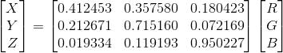

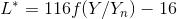

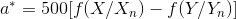

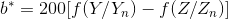

我们可以使用skimage.color.rgb2lab()来实现这个操作。

### 初始化聚类中心

- 首先，我们设置超像素或者说聚类的数量K。

- 然后按照等大小将图片分为K个超像素块。

    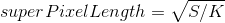

- 初始化聚类中心，用一个名为Cluster的数组保存它们。

    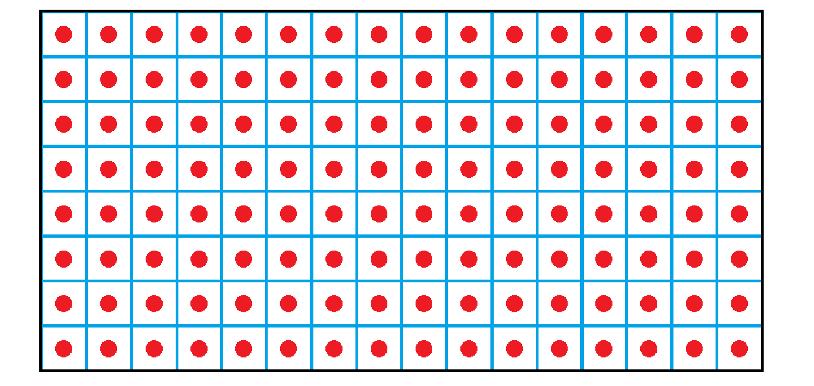

- 我们需要名为Distance和Label的两个数组，分别用来保存当前点和最近的聚类中心的距离和最近的聚类中心的标签。

### 迭代聚类

对于每次迭代，我们选取点周围2Sx2S的区域：

- 计算Distance数组。(每个点与它们最近的聚类中心的距离)

    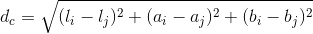

    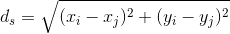

    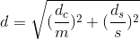
    
    - m(Nc)是Lab空间中的最大颜色距离，设置为10。
    
    - s(Ns)是Lab空间中的最大空间距离，设置为superPixelLength。

- 选择Label数组。(每个点最近的聚类中心的标签)

- 更新聚类中心。(使用每个聚类的几何中心)

## Attention

### Why we change rgb to lab?

- It is not only a device independent color model, but also a color model based on physiological characteristics. LAB color model consists of three elements, one is brightness (L), and A and B are two color channels. A includes colors from dark green (low brightness value) to gray (medium brightness value) to bright pink (high brightness value); B is from bright blue (low brightness value) to gray (medium brightness value) to yellow (high brightness value). Therefore, this kind of color will produce bright colors after mixing, and lab mode defines the most colors.

- The segmentation effect of LAB space is much better than that of RGB space.

### Why we choose the 2Sx2S region?
<a id="1.2.2"/>

- Reduce super pixel search area.

- The complexity of SLIC is independent of the number of super pixels.

## Optimization
<a id="1.3"/>

### Choose the gradient
<a id="1.3.1"/>

It can avoid locating the super pixel on the edge and reduce the chance of replacing the super pixel with noise.

In the 3x3 domain of every center:

- Calculate gradient of 8 neighbors.

    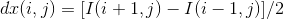
    
    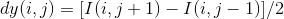
    
    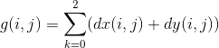

- Choose the point with the smallest gradient as the center node of the new center.

### Merge all small blocks
<a id="1.3.2"/>

Because of the characteristics of clustering process, it is not guaranteed that every class can be continuous in XY space.

First, BFS is used to find out each connected block.

The time complexity is O(mn), where n and m are the length and width of the image respectively.

Then, the small connected blocks are merged by using parallel search set when the size of the block is less than the preset threshold.

- Count all connected graphs.

- Initialize the threshold.

- Merge small block into nearby block.

### Draw the boundary
<a id="1.3.3"/>

Obviously, the points with different labels in four directions are the boundary points.

Because of traversal method of array, we just need to look at the points on the right and below.

Further, if left or above is marked, we can skip this point.

## Result
<a id="1.4"/>

Super pixels:

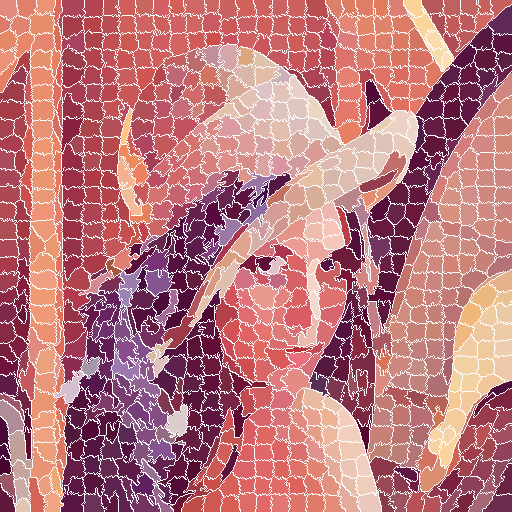

Splitted image:

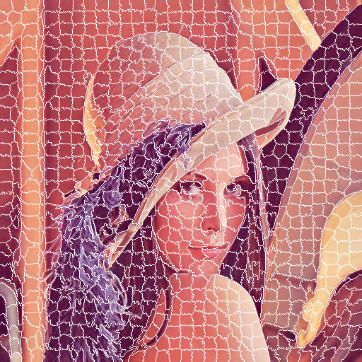